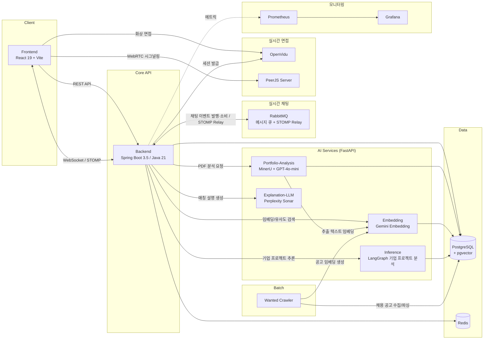
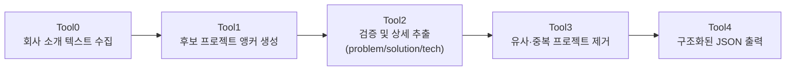

<div align="center">


# PORTMATCH

**AI가 포트폴리오를 읽고, 나에게 맞는 기업과 공고를 찾아주는 양방향 채용 매칭 플랫폼**

지원자에게는 데이터 기반 커리어 분석과 맞춤 공고를, 기업에게는 정교한 인재 필터링을 제공합니다.

[](https://react.dev)
[](https://www.typescriptlang.org)
[](https://spring.io/projects/spring-boot)
[](https://openjdk.org)
[](https://fastapi.tiangolo.com)
[](https://www.langchain.com)
[](https://www.postgresql.org)
[](https://www.docker.com)

</div>

---

## 목차

1. [서비스 소개](#서비스-소개)
2. [팀원 및 기여도](#팀원-및-기여도)
3. [핵심 기능](#핵심-기능)
4. [시스템 아키텍처](#시스템-아키텍처)
5. [AI 매칭 파이프라인](#ai-매칭-파이프라인)
6. [기술 스택](#기술-스택)
7. [최근 개선 사항](#최근-개선-사항)
8. [실행 및 상세 문서](#실행-및-상세-문서)

---

## 서비스 소개

**PORTMATCH**는 이력서·포트폴리오 텍스트를 AI로 분석해 지원자에게는 맞춤형 공고 추천을, 기업에게는 인재 필터링 기능을 제공하는 **양방향 채용 매칭 플랫폼**입니다.

기존 채용 플랫폼의 단순 키워드 매칭 방식은 지원자의 실제 프로젝트 경험과 기업의 요구를 정확히 연결하지 못한다는 문제의식에서 출발했습니다. PORTMATCH는 PDF 포트폴리오를 LLM으로 구조화하고, 이를 **도메인 · 문제 정의 · 해결 방식 · 기술 스택 · 아키텍처**의 다차원 벡터로 임베딩하여 기업/공고와의 유사도를 계산합니다. 단순 매칭 점수를 넘어, *왜* 이 기업과 잘 맞는지를 LLM이 자연어로 설명하고 지원서 작성 전략까지 제안합니다.

> 팀 프로젝트 개발 기간: 2026.01.05 ~ 2026.02.09 · 이후 개선 이력은 [최근 개선 사항](#최근-개선-사항)에 정리했습니다.

| 사용자 | 서비스 이용 흐름 |
| --- | --- |
| 지원자 | 이력서·포트폴리오 등록 → AI 분석 → 기업·공고 추천 → 지원 → 면접 제안 수락 → 화상 면접 |
| 기업 | 기업 정보·공고 관리 → 인재 검색·추천 → 지원자 이력서 확인 → 메신저로 면접 제안 → 일정 관리·화상 면접 |
| 공통 | 공고 탐색·스크랩, 면접 준비 템플릿, 포트폴리오 첨삭, 스피치 타이머 등 취업 준비 도구 |

아래 화면은 팀 프로젝트 시연 당시 저장한 캡처입니다. 채팅의 현재 구현 구조는 [MQ 도입 내용](#1-채팅-구조-개선--rabbitmq와-transactional-outbox)을 참고하세요.

<p align="center">
  
</p>

---

## 팀원 및 기여도

커밋 메시지와 실제 변경 경로를 함께 확인해 주요 기여 영역을 정리했습니다. 공동 작업한 기능은 여러 팀원에 걸쳐 표기했습니다. **담당 기능명을 클릭하면 해당 설명으로 이동합니다.**

| 팀원 | 주요 담당 및 기여 내용 | 커밋 수 | 커밋 비중 |
| --- | --- | ---: | ---: |
| 강지석 | **Backend · AI · Infra** — [AI 포트폴리오 분석](#1-ai-포트폴리오-분석)·[이력서 API](#4-이력서-지원-및-지원-현황-관리), [기업 프로젝트 추론](#ai-매칭-파이프라인) 및 [기업 매칭](#2-ai-기업-매칭--합격-전략-리포트)·[공고 매칭](#3-채용-공고-매칭)·[인재 매칭](#5-기업-채용-관리-및-인재-추천), [임베딩·스코어링](#ai-매칭-파이프라인), [Docker·CI/CD·MinerU 확장](#시스템-아키텍처). 이후 [RabbitMQ 채팅 전환](#1-채팅-구조-개선--rabbitmq와-transactional-outbox) 및 [조회수 동시성 개선](#2-조회수-동시성-버그-수정--원자적-update) | 217 | 28.1% |
| 장진욱 | **Frontend** — 메인·회원가입·로그인, [이력서 작성·지원](#4-이력서-지원-및-지원-현황-관리), [기업 정보·공고 관리](#5-기업-채용-관리-및-인재-추천), [메신저·알림](#6-메신저-및-면접-일정-조율), [취업 준비 편의 도구 UI](#8-취업-준비-도구) | 145 | 18.8% |
| 이은지 | **Frontend** — [포트폴리오 분석](#1-ai-포트폴리오-분석)·[기업 추천](#2-ai-기업-매칭--합격-전략-리포트)·[공고 추천](#3-채용-공고-매칭)·[인재 추천](#5-기업-채용-관리-및-인재-추천) 화면 및 API 연동, [매칭 점수·레이더 차트 시각화](#2-ai-기업-매칭--합격-전략-리포트), 기업 검색 | 117 | 15.1% |
| 오예지 | **Frontend · 화상 면접 연동** — [마이페이지·지원 내역](#4-이력서-지원-및-지원-현황-관리), [면접 일정](#6-메신저-및-면접-일정-조율)·[로비·화상 면접 UI 및 PeerJS 면접룸 생성·삭제](#7-화상-면접), [포트폴리오 첨삭 화면·서비스](#8-취업-준비-도구) | 114 | 14.7% |
| 조인예 | **Backend · Crawler** — [기업·채용 공고 API](#5-기업-채용-관리-및-인재-추천), 스크랩, [면접 일정](#6-메신저-및-면접-일정-조율)·[WebRTC 세션 API](#7-화상-면접), [원티드 공고 수집·DB 적재 자동화](#시스템-아키텍처) | 98 | 12.7% |
| 손주영 | **Backend · AI · Monitoring** — 인증·회원 관리, [공고 지원·지원자 이력서 조회·합불 처리](#4-이력서-지원-및-지원-현황-관리), [포트폴리오 분석](#1-ai-포트폴리오-분석)·[임베딩 및 기업 프로젝트 분석 연동](#ai-매칭-파이프라인), [Prometheus·Grafana](#시스템-아키텍처) | 82 | 10.6% |
| **합계** | **6명** | **773** | **100.0%** |


---

## 핵심 기능

### 1. AI 포트폴리오 분석

PDF 포트폴리오를 업로드하면 **MinerU**가 문서를 파싱하고, LLM이 프로젝트 단위로 `문제 정의` · `해결 방식` · `기술 스택` · `아키텍처 경험` · `도메인`을 구조화해 추출합니다.

<table>
<tr>
<td></td>
<td></td>
</tr>
</table>

<p align="center"></p>

### 2. AI 기업 매칭 & 합격 전략 리포트

구조화된 포트폴리오를 기업이 보유한 프로젝트 데이터와 벡터 유사도 비교하여 **프로젝트 · 도메인 · 문제 정의 · 해결 방식 · 기술 스택** 5개 축의 매치 스코어를 레이더 차트로 시각화합니다. 상세 리포트에서는 항목별 비교표와 함께, LLM이 생성한 매칭 이유 · 포트폴리오 강조 포인트 · 지원서 작성 치트키 · 합격 전략 가이드를 확인할 수 있습니다.

<p align="center"></p>

<table>
<tr>
<td></td>
<td></td>
</tr>
</table>

### 3. 채용 공고 매칭

기업 단위 매칭과 별개로, 실제 등록된 **채용 공고**와도 `도메인 · 아키텍처 · 기술 스택 · 문제 정의` 4개 축으로 매칭도를 계산해 추천합니다. 공고별 상세 비교 리포트에서 내 포트폴리오와 공고 요건이 어떻게 대응되는지 확인하고 바로 지원할 수 있습니다.

<p align="center"></p>

<table>
<tr>
<td></td>
<td></td>
</tr>
</table>

### 4. 이력서 지원 및 지원 현황 관리

전체 공고를 탐색하고 저장한 이력서를 선택해 지원합니다. 지원자는 마이페이지에서 지원 내역과 면접 일정을 확인하고, 기업은 공고별 지원자와 이력서를 확인해 채용 절차를 진행합니다.

<table>
<tr>
<td align="center" width="50%"><br/>전체 채용 공고 탐색</td>
<td align="center" width="50%"><br/>이력서 선택 및 지원서 제출</td>
</tr>
</table>

### 5. 기업 채용 관리 및 인재 추천

기업은 채용 공고를 등록·수정하고 공고별 지원 현황을 관리합니다. 인재 추천에서는 자연어 검색과 기술 스택 조건으로 포트폴리오 기반 후보를 찾고, 후보의 이력서를 확인할 수 있습니다.

<table>
<tr>
<td align="center" width="50%"><br/>기업의 채용 공고 관리</td>
<td align="center" width="50%"><br/>공고별 지원자 확인 및 면접 제안</td>
</tr>
</table>

### 6. 메신저 및 면접 일정 조율

지원자와 기업이 메신저로 대화하고, 기업이 날짜·시간을 지정해 면접을 제안하면 지원자는 수락 또는 거절할 수 있습니다. 확정된 면접은 일정 목록에서 확인합니다. 현재 일반 채팅은 REST API로 저장하고 STOMP 구독으로 새 메시지를 수신합니다.

<table>
<tr>
<td align="center" width="50%"><br/>기업의 면접 일정 제안</td>
<td align="center" width="50%"><br/>지원자의 메신저 내 면접 제안 수락·거절</td>
</tr>
</table>

### 7. 화상 면접

면접 일정에서 면접룸으로 이동해 로비에서 카메라·마이크를 확인하고 화상 면접에 참여합니다. 기업 측에서는 면접을 종료하고 완료 상태로 전환할 수 있습니다.

<table>
<tr>
<td align="center" width="50%"><br/>면접 입장 전 로비</td>
<td align="center" width="50%"><br/>기업 측 화상 면접 화면</td>
</tr>
</table>

### 8. 취업 준비 도구

면접 예상 질문과 답변을 템플릿으로 정리하고, PDF 포트폴리오 첨삭으로 내용을 점검합니다. 스피치 타이머, 실수령액 계산기, 협업 일정 관리, 단위변환기도 제공합니다.

<table>
<tr>
<td align="center" width="50%"><br/>면접 예상 질문·답변 작성 템플릿</td>
<td align="center" width="50%"><br/>PDF 포트폴리오 첨삭</td>
</tr>
</table>

<details>
<summary>편의 도구 화면 더 보기</summary>

<table>
<tr>
<td align="center" width="50%"><br/>스피치 타이머</td>
<td align="center" width="50%"><br/>실수령액 계산기</td>
</tr>
<tr>
<td align="center" width="50%"><br/>협업 일정 관리</td>
<td align="center" width="50%"><br/>글로벌 단위변환기</td>
</tr>
</table>

</details>

전체 36장과 개인·기업별 진행 순서는 [시연 시나리오](exec/README.md#6-시연-시나리오)에서 확인할 수 있습니다.

---

## 시스템 아키텍처

Spring Boot 백엔드가 API 게이트웨이 겸 도메인 서버 역할을 하고, 파싱 · 임베딩 · 추론 · 설명 생성을 담당하는 4개의 FastAPI 기반 AI 서비스가 독립적으로 분리된 **MSA** 구조입니다.



---

## AI 매칭 파이프라인

**① 포트폴리오 → 벡터화**

```
PDF 업로드 → MinerU 파싱 → LLM 프로젝트 요약(문제/해결/기술/아키텍처) → Gemini 임베딩 → pgvector 저장
```

**② 기업 프로젝트 추론 (Inference · LangGraph)**

회사 소개만으로 기업이 어떤 프로젝트를 했을지 후보를 생성하고, 검증 → 중복 제거 → 구조화 단계를 거쳐 신뢰도 높은 프로젝트 정보만 남기는 5단계 그래프 파이프라인입니다.



**③ 매칭 및 설명 생성**

포트폴리오 임베딩과 기업/공고 임베딩 간 벡터 유사도로 매치 스코어를 산출한 뒤, Explanation-LLM이 두 프로젝트를 비교해 매칭 사유·강조 포인트·합격 전략을 한국어 자연어로 생성합니다.

---

## 기술 스택

<table>
<tr>
<th width="18%">영역</th>
<th>스택</th>
</tr>
<tr>
<td><b>Frontend</b></td>
<td>
React 19 · TypeScript · Vite · Tailwind CSS 4 · TanStack Query · Zustand · React Router 7 · Axios · Recharts · Framer Motion · AOS · Firebase · openvidu-browser · peerjs
</td>
</tr>
<tr>
<td><b>Backend</b></td>
<td>
Java 21 · Spring Boot 3.5 · Spring Data JPA · QueryDSL · Spring Security · Flyway · PostgreSQL Driver · AWS S3 SDK · OpenVidu Java Client · Springdoc(Swagger) · Spring Actuator + Micrometer(Prometheus) · Spring AMQP · Spring WebSocket
</td>
</tr>
<tr>
<td><b>AI / ML Services</b></td>
<td>
Python · FastAPI · LangChain / LangGraph · MinerU(PDF/OCR 파싱) · OpenAI GPT-4o-mini · Google Gemini Embedding · Perplexity Sonar
</td>
</tr>
<tr>
<td><b>Data</b></td>
<td>
PostgreSQL 17 + <code>pgvector</code> · Redis
</td>
</tr>
<tr>
<td><b>Realtime</b></td>
<td>
RabbitMQ · STOMP / WebSocket · @stomp/stompjs · OpenVidu(WebRTC 화상 면접) · PeerJS Server
</td>
</tr>
<tr>
<td><b>Batch / Crawler</b></td>
<td>
Python 기반 원티드(Wanted) 채용 공고 크롤러 → 파싱 → 임베딩 생성 파이프라인
</td>
</tr>
<tr>
<td><b>Infra / DevOps</b></td>
<td>
Docker Compose · GitLab CI/CD(변경 감지 기반 조건부 빌드) · Nginx + Certbot · Prometheus · Grafana
</td>
</tr>
</table>


---

## 최근 개선 사항

팀 프로젝트 이후 **강지석**이 진행한 구조 개선과 버그 수정입니다. 아래 수치는 저장된 실험 결과이며 운영 환경의 성능 보장 수치가 아닙니다.

### 1. 채팅 구조 개선 — RabbitMQ와 Transactional Outbox

| 항목 | 변경 내용 |
| --- | --- |
| 이전 | Firestore 중심의 채팅 저장·실시간 구독 |
| 현재 | REST API로 PostgreSQL에 메시지 저장 → RabbitMQ 이벤트 처리 → STOMP로 실시간 전달 |
| 신뢰성 개선 | 메시지와 발행할 이벤트를 같은 DB 트랜잭션에 저장하는 **Outbox 모드**, 재발행, 소비자 중복 처리 방지, 재시도·DLQ 추가 |
| 비교 검증 | DB 커밋 직후 장애 시나리오에서 Direct 전달률 **99.8991%**(1회), Outbox **100%**(2회). 회당 1,000개 메시지로 측정 |

`CHAT_PUBLISH_MODE`로 `direct`와 `outbox`를 선택하며 **기본값은 `direct`**입니다. Outbox는 `CHAT_PUBLISH_MODE=outbox`일 때 동작합니다. 확인 응답 이후 장애 실험에서는 중복도 관측됐으며, 중복 처리 방지와 함께 검증했습니다. 이 전달률은 브라우저 수신 보장을 의미하지 않습니다.

구현: `5ab4ed4` · 프론트 전환: `da5178b` · 실험: `46ce4a2` · [Direct / Outbox 비교 결과](experiment/results/report.md)

### 2. 조회수 동시성 버그 수정 — 원자적 UPDATE

| 항목 | 변경 내용 |
| --- | --- |
| 문제 | 동시에 공고를 조회하면 같은 조회수를 읽고 덮어써 증가분이 유실됨 |
| 수정 | 엔티티 조회·Java 증가·저장 방식에서 DB의 `SET vcnt = vcnt + 1` 원자적 UPDATE로 변경 |
| 결정적 재현 | 동시 요청 2건, 20회 실험: 수정 전 매회 1건 유실 → 수정 후 유실 0건 |
| 부하 검증 | 총 1,000건·동시 실행 20개를 10회 반복: 수정 전 총 9,446건 유실 → 수정 후 유실 0건 |
| 회귀 검증 | 기록된 Backend 전체 테스트 **36/36 통과** |

구현: `bcfcd72` · 재현 테스트: `4a60eb7` · [조회수 동시성 전후 검증 보고서](experiment/JOB_POSTING_VIEW_COUNT_CONCURRENCY.md)

---

## 실행 및 상세 문서

- [개발 환경·환경변수·빌드 및 배포·전체 시연 화면](exec/README.md)
- [기업 프로젝트 추론 서비스](Inference/README.md)
- [포트폴리오 분석 서비스](Portfolio-Analysis/README.md)
- [임베딩 서비스](Embedding/README.md)
- [데이터베이스](DB/README.md)
