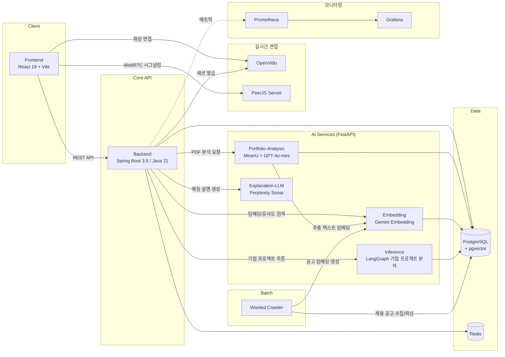
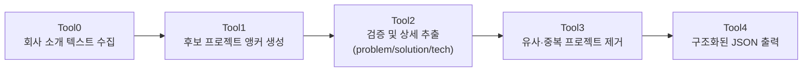

<div align="center">


# PORTMATCH

**AI가 포트폴리오를 읽고, 나에게 맞는 기업과 공고를 찾아주는 양방향 채용 매칭 플랫폼**

지원자에게는 데이터 기반 커리어 분석과 맞춤 공고를, 기업에게는 정교한 인재 필터링을 제공합니다.

[](https://react.dev)
[](https://www.typescriptlang.org)
[](https://spring.io/projects/spring-boot)
[](https://openjdk.org)
[](https://fastapi.tiangolo.com)
[](https://www.langchain.com)
[](https://www.postgresql.org)
[](https://www.docker.com)

</div>

---

## 목차

1. [서비스 소개](#서비스-소개)
2. [핵심 기능](#핵심-기능)
3. [시스템 아키텍처](#시스템-아키텍처)
4. [AI 매칭 파이프라인](#ai-매칭-파이프라인)
5. [기술 스택](#기술-스택)

---

## 서비스 소개

**PORTMATCH**는 이력서·포트폴리오 텍스트를 AI로 분석해 지원자에게는 맞춤형 공고 추천을, 기업에게는 인재 필터링 기능을 제공하는 **양방향 채용 매칭 플랫폼**입니다.

기존 채용 플랫폼의 단순 키워드 매칭 방식은 지원자의 실제 프로젝트 경험과 기업의 요구를 정확히 연결하지 못한다는 문제의식에서 출발했습니다. PORTMATCH는 PDF 포트폴리오를 LLM으로 구조화하고, 이를 **도메인 · 문제 정의 · 해결 방식 · 기술 스택 · 아키텍처**의 다차원 벡터로 임베딩하여 기업/공고와의 유사도를 계산합니다. 단순 매칭 점수를 넘어, *왜* 이 기업과 잘 맞는지를 LLM이 자연어로 설명하고 지원서 작성 전략까지 제안합니다.

> 개발 기간: 2026.01.05 ~ 2026.02.09

<p align="center">
  
</p>

---

## 핵심 기능

### 1. AI 포트폴리오 분석

PDF 포트폴리오를 업로드하면 **MinerU**가 문서를 파싱하고, LLM이 프로젝트 단위로 `문제 정의` · `해결 방식` · `기술 스택` · `아키텍처 경험` · `도메인`을 구조화해 추출합니다.

<table>
<tr>
<td></td>
<td></td>
</tr>
</table>

<p align="center"></p>

### 2. AI 기업 매칭 & 합격 전략 리포트

구조화된 포트폴리오를 기업이 보유한 프로젝트 데이터와 벡터 유사도 비교하여 **프로젝트 · 도메인 · 문제 정의 · 해결 방식 · 기술 스택** 5개 축의 매치 스코어를 레이더 차트로 시각화합니다. 상세 리포트에서는 항목별 비교표와 함께, LLM이 생성한 매칭 이유 · 포트폴리오 강조 포인트 · 지원서 작성 치트키 · 합격 전략 가이드를 확인할 수 있습니다.

<p align="center"></p>

<table>
<tr>
<td></td>
<td></td>
</tr>
</table>

### 3. 채용 공고 매칭

기업 단위 매칭과 별개로, 실제 등록된 **채용 공고**와도 `도메인 · 아키텍처 · 기술 스택 · 문제 정의` 4개 축으로 매칭도를 계산해 추천합니다. 공고별 상세 비교 리포트에서 내 포트폴리오와 공고 요건이 어떻게 대응되는지 확인하고 바로 지원할 수 있습니다.

<p align="center"></p>

<table>
<tr>
<td></td>
<td></td>
</tr>
</table>

---

## 시스템 아키텍처

Spring Boot 백엔드가 API 게이트웨이 겸 도메인 서버 역할을 하고, 파싱 · 임베딩 · 추론 · 설명 생성을 담당하는 4개의 FastAPI 기반 AI 서비스가 독립적으로 분리된 **MSA** 구조입니다.



---

## AI 매칭 파이프라인

**① 포트폴리오 → 벡터화**

```
PDF 업로드 → MinerU 파싱 → LLM 프로젝트 요약(문제/해결/기술/아키텍처) → Gemini 임베딩 → pgvector 저장
```

**② 기업 프로젝트 추론 (Inference · LangGraph)**

회사 소개만으로 기업이 어떤 프로젝트를 했을지 후보를 생성하고, 검증 → 중복 제거 → 구조화 단계를 거쳐 신뢰도 높은 프로젝트 정보만 남기는 5단계 그래프 파이프라인입니다.



**③ 매칭 및 설명 생성**

포트폴리오 임베딩과 기업/공고 임베딩 간 벡터 유사도로 매치 스코어를 산출한 뒤, Explanation-LLM이 두 프로젝트를 비교해 매칭 사유·강조 포인트·합격 전략을 한국어 자연어로 생성합니다.

---

## 기술 스택

<table>
<tr>
<th width="18%">영역</th>
<th>스택</th>
</tr>
<tr>
<td><b>Frontend</b></td>
<td>
React 19 · TypeScript · Vite · Tailwind CSS 4 · TanStack Query · Zustand · React Router 7 · Axios · Recharts · Framer Motion · AOS · Firebase · openvidu-browser · peerjs
</td>
</tr>
<tr>
<td><b>Backend</b></td>
<td>
Java 21 · Spring Boot 3.5 · Spring Data JPA · QueryDSL · Spring Security · Flyway · PostgreSQL Driver · AWS S3 SDK · OpenVidu Java Client · Springdoc(Swagger) · Spring Actuator + Micrometer(Prometheus)
</td>
</tr>
<tr>
<td><b>AI / ML Services</b></td>
<td>
Python · FastAPI · LangChain / LangGraph · MinerU(PDF/OCR 파싱) · OpenAI GPT-4o-mini · Google Gemini Embedding · Perplexity Sonar
</td>
</tr>
<tr>
<td><b>Data</b></td>
<td>
PostgreSQL 17 + <code>pgvector</code> · Redis
</td>
</tr>
<tr>
<td><b>Realtime</b></td>
<td>
OpenVidu(WebRTC 화상 면접) · PeerJS Server
</td>
</tr>
<tr>
<td><b>Batch / Crawler</b></td>
<td>
Python 기반 원티드(Wanted) 채용 공고 크롤러 → 파싱 → 임베딩 생성 파이프라인
</td>
</tr>
<tr>
<td><b>Infra / DevOps</b></td>
<td>
Docker Compose · GitLab CI/CD(변경 감지 기반 조건부 빌드) · Nginx + Certbot · Prometheus · Grafana
</td>
</tr>
</table>
